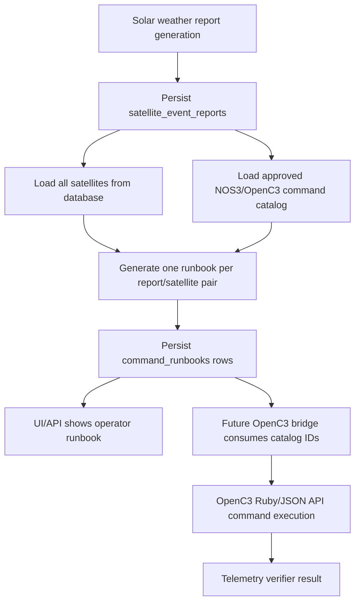

# Catalog-Backed CubeSat Command Runbooks Subtasks

Generated: 2026-06-21

## Goal

Implement the next Soteria command pipeline slice:

1. Convert `docs/cubesat-openc3-command-catalog.md` from a planning/source-of-truth document into a runtime-enforced, machine-readable NOS3/OpenC3 command catalog.
2. Replace the current satellite-command tool stubs with catalog-backed command lookup and command-plan drafting.
3. Connect the report pipeline to command-runbook generation so every generated report produces one catalog-backed command runbook for every satellite in the database.
4. Render operator-usable OpenC3 Ruby procedure snippets for the selected NOS3 simulator commands while storing structured catalog IDs, targets, commands, args, and verifier telemetry for backend enforcement.

The finished slice does not need to run a CubeSat simulation or execute commands against OpenC3 yet. It must produce real NOS3/OpenC3 simulator command runbooks that could be used by an operator or later bridge.

## Current State

Local source-of-truth and code inspected:

- `docs/cubesat-openc3-command-catalog.md` contains a source-backed NOS3/OpenC3 command catalog and a machine-readable appendix.
- `src/backend/agent/definition.py` defines `satellite-command-agent`, but its prompt currently requires draft-only output and says not to produce uplink-ready commands.
- `src/backend/agent/tools.py` contains command stubs:
  - `get_satellite_command(...)` returns `"Return redacted command here."`
  - `draft_satellite_command_plan(...)` returns `"Return draft command plan here."`
- `src/backend/agent/report_generation.py` generates and persists validated event-window satellite reports.
- `src/backend/agent/report_pipeline.py` builds report evidence bundles from event windows and satellites.
- `src/backend/agent/report_models.py` models report findings, possible outcomes, and validation notes.
- `src/backend/api/agent.py` persists reports from `/api/poller/report`.
- `src/backend/api/operations.py` can insert `command_runbooks` records, but they are not catalog validated.
- `supabase/migrations/20260621050000_create_command_runbooks.sql` creates `public.command_runbooks` with `commands jsonb`, metadata, source, status, and risk-level fields.

Current gaps:

- No runtime command catalog loader.
- No catalog command ID resolver.
- No enforced mapping from report outcomes to approved command IDs.
- No runbook generation after report persistence.
- No guarantee that every database satellite receives a runbook.
- No OpenC3 bridge or command execution path.
- No telemetry verification loop.

## Verified OpenC3/NOS3 Scripting Basis

OpenC3 supports script execution in Ruby and Python. The Soteria runbook renderer should use Ruby as the first operator-script format because COSMOS/OpenC3 examples and existing NOS3 operator workflows commonly use Ruby procedure scripts, while keeping the stored backend contract language-neutral.

External references to attach to implementation:

- [OpenC3 Scripting API](https://docs.openc3.com/docs/guides/scripting-api): OpenC3 scripting is implemented using Ruby or Python; scripts inside COSMOS include `openc3/api`, and scripts outside COSMOS include `openc3/script`.
- [OpenC3 Scripting API command section](https://docs.openc3.com/docs/guides/scripting-api): command scripts use `cmd(...)` and telemetry scripts use `tlm(...)`; no-check helpers such as `cmd_no_checks` and `cmd_no_hazardous_check` exist but should be forbidden by Soteria policy unless a later explicit lab-only exception is created.
- [OpenC3 CLI](https://docs.openc3.com/docs/getting-started/cli): OpenC3 CLI can spawn or run Ruby scripts such as `openc3.sh cli script run INST/procedures/stash.rb`; script execution requires OpenC3 API authentication.
- [NOS3 Ground Software](https://nos3.readthedocs.io/en/latest/NOS3_Ground_Software.html): NOS3 can use COSMOS/OpenC3 as ground software for command and telemetry.
- [NOS3 Commissioning Scenario](https://nos3.readthedocs.io/en/latest/Scenario_Commissioning.html) and [NOS3 Demonstration Scenario](https://nos3.readthedocs.io/en/latest/Scenario_Demo.html): source scenarios for the initial sample payload, radio, cFS, and ADCS commands.

Policy consequence: backend data should never store free-form agent-authored commands as the authoritative command. It should store `catalog_command_id`, target, command, typed args, preconditions, and verifier telemetry from the catalog. Ruby script text is a rendered artifact derived from those structured records.

## Target Flow



## Definitions

- **Catalog command**: A machine-readable record derived from `docs/cubesat-openc3-command-catalog.md`, including command ID, target, command, args, preconditions, verifier, safety flags, and source evidence.
- **Real command runbook**: A Soteria runbook that contains source-backed NOS3/OpenC3 simulator commands from the catalog. It may include Ruby snippets for operator execution, but it remains simulator-only and human-reviewable.
- **No-action runbook**: A runbook row created for a satellite/report pair where the policy finds no safe catalog command. This still satisfies the "runbook for each satellite in the DB" verification requirement and records why no command was recommended.
- **Executable later**: A catalog command whose `status` and policy flags allow future bridge execution after allowlist, precondition, review, expiry, and verifier checks. This task set does not implement execution.

## Assumptions

- "Every satellite in the DB" means every active satellite returned by the backend's satellite query for the report/runbook workflow. If the product has inactive/decommissioned statuses, T6 must make that filter explicit.
- The generated runbooks remain `DRAFT / HUMAN REVIEW REQUIRED` unless every selected command has `human_review_required = false` and the user later approves an execution bridge.
- Existing `command_runbooks` can be reused, but it needs stronger metadata/dedupe guarantees for catalog-backed output.
- The first implementation should reject unresolved catalog rows rather than generating a copy-pasteable command for them.
- Solar-weather-to-command policy must be conservative. When there is no source-backed NOS3 command for a condition, generate a no-action/manual-review runbook rather than inventing a command.

## Critical Path

T1 -> T2 -> T3 -> T4 -> T5 -> T6 -> T7 -> T9

Parallel work:

- T5 schema work can start after T1 defines the catalog/runbook data contract.
- T8 API/readback work can start once T5 defines persisted shape.
- T10 documentation and smoke verification should finish after T6/T7.

Minimum complete slice:

- Machine-readable catalog loads from repo code.
- `get_satellite_command` returns only approved catalog records.
- Report pipeline generates one runbook per persisted report and per database satellite.
- Every command step has a valid `catalog_command_id`.
- Every selected command has rendered Ruby procedure text derived from the catalog.
- Integration test seeds multiple satellites and verifies a runbook row exists for each satellite.

## Subtasks

### T1: Materialize The NOS3/OpenC3 Command Catalog For Runtime Use

Outcome: The backend has a validated, machine-readable command catalog derived from `docs/cubesat-openc3-command-catalog.md`.

Scope: Add a repo-local catalog artifact and loader. Out of scope: report policy, runbook generation, OpenC3 execution.

Context packet:

- `docs/cubesat-openc3-command-catalog.md`
- `src/backend/agent/tools.py`
- `src/backend/agent/report_models.py`
- Existing backend dependency style and tests under `src/backend/tests/`

Agent instructions:

- Extract the machine-readable appendix from `docs/cubesat-openc3-command-catalog.md` into a backend-owned artifact, for example:
  - `src/backend/agent/catalogs/nos3_openc3_v1_07_04_cmdcat_20260621.json`
  - `src/backend/agent/command_catalog.py`
- Add Pydantic models or typed dataclasses for:
  - catalog metadata
  - command record
  - command arg
  - verifier telemetry
  - safety flags
  - unresolved/manual-only/automation-allowed status
- Validate at load time:
  - unique command IDs
  - `catalog_version` exists
  - executable rows have `target`, `command`, and verifier fields
  - unresolved rows cannot be returned as executable commands
  - argument defaults are among allowed values when `allowed_values` exists
  - `automated_allowed` cannot be true for unresolved rows
- Expose lookup helpers:
  - `load_command_catalog()`
  - `get_catalog_command(command_id)`
  - `find_catalog_commands(intent=None, outcome=None, status=None, automated_allowed=None)`
  - `assert_catalog_command_ids(command_ids)`

Expansion path: Add a small extraction/check script later that compares the JSON artifact against the markdown appendix. The first implementation can manually copy the appendix if tests protect drift.

Reuse/library check: Prefer existing backend validation tools such as Pydantic rather than a custom parser.

Acceptance criteria:

- Unit tests load the catalog successfully.
- Unit tests confirm known IDs such as `sample_disable`, `radio_enable_output`, and an ADCS mode command resolve to catalog records.
- Unit tests confirm unresolved commands cannot be selected as executable.
- Unit tests fail on duplicate command IDs.

Validation:

- Run targeted backend tests for the catalog module.
- Add a fixture that loads the exact committed JSON catalog artifact.

Dependencies: None.

Handoff: Catalog artifact path, loader API, validation rules, and test names.

### T2: Define Conservative Solar-Weather Outcome To Catalog-Command Policy

Outcome: A deterministic policy maps report findings and possible outcomes to catalog command recommendations, manual-review decisions, or no-action runbooks.

Scope: Implement policy logic only. Out of scope: persistence, agent tools, OpenC3 execution.

Context packet:

- `src/backend/agent/report_models.py`
- `src/backend/agent/report_generation.py`
- `docs/cubesat-openc3-command-catalog.md`
- T1 catalog loader

Agent instructions:

- Add a policy module, for example `src/backend/agent/command_policy.py`.
- Inputs should include:
  - report severity
  - `SatelliteImpactFinding`
  - possible outcomes
  - satellite metadata
  - catalog version
- Outputs should include:
  - selected `catalog_command_id` values
  - reason for each selection
  - review requirement
  - risk level
  - no-action reason when no command is selected
- Start with a conservative mapping:
  - payload/data-quality risk -> consider `sample_disable` for sample-payload protection if the satellite profile supports the sample payload.
  - payload recovery/setup -> consider `sample_enable` only for explicit recovery/setup workflows, not automatically for solar storm onset.
  - communications telemetry recovery -> consider `radio_resume_output` or `radio_enable_output` only when the finding indicates telemetry is expected but stale/paused in the NOS3 bench.
  - communications power/quiet posture -> consider `radio_disable_output`, human review required because telemetry loss is expected.
  - ADCS/star-tracker/pointing degradation -> consider a catalogued ADCS passive or sun-safe command only if the catalog has an exact target/command/allowed mode and the policy marks the scenario as simulator safe.
  - generic radiation protection -> no-action/manual-review unless the catalog has a concrete NOS3/OpenC3 command for that exact action.
  - orbit drag/orbit prediction degradation -> no-action runbook unless a later maneuver/planning command exists in the catalog.
  - EPS/load shedding -> use only catalogued EPS or indirect load commands; unresolved EPS commands must yield no-action/manual-review.
- Make it impossible for the policy to return a command that is missing from the catalog.
- Record policy version in every output, for example `solar-weather-command-policy.20260621`.

Expansion path: Add satellite capability profiles so the same solar-weather outcome can map differently for sample-payload, ADCS-heavy, radio-only, or future compute-payload satellites.

Reuse/library check: Keep this as a small deterministic mapping first. Do not introduce an LLM call into policy selection.

Acceptance criteria:

- Unit tests cover at least five outcomes:
  - payload protect selects `sample_disable`
  - radio recovery selects `radio_resume_output` or `radio_enable_output`
  - radio quiet posture selects `radio_disable_output` with human review
  - ADCS degradation selects a valid ADCS mode command when present
  - orbit drag produces no-action/manual-review
- Tests prove every selected command ID resolves through T1.
- Tests prove unresolved/generic commands are rejected.

Validation:

- Run policy tests with a fake catalog fixture and the real catalog fixture.

Dependencies: T1.

Handoff: Policy module, mappings, unresolved cases, and test coverage.

### T3: Replace Satellite Command Tool Stubs With Catalog-Backed Tools

Outcome: The agent's command tools return structured catalog records and draft runbook plans instead of placeholder text.

Scope: Update `get_satellite_command(...)`, `draft_satellite_command_plan(...)`, and the satellite-command-agent prompt contract. Out of scope: runbook persistence and OpenC3 execution.

Context packet:

- `src/backend/agent/tools.py`
- `src/backend/agent/definition.py`
- T1 catalog loader
- T2 policy module

Agent instructions:

- Replace `get_satellite_command(...)` with a catalog-backed implementation.
- Shape the tool input so the agent can ask for commands by:
  - command ID
  - intent
  - report outcome
  - satellite ID/profile
  - automation/manual status
- Shape the tool output as structured JSON-compatible data:

```json
{
  "catalog_version": "nos3-openc3-v1_07_04-cmdcat.20260621",
  "commands": [
    {
      "catalog_command_id": "sample_disable",
      "target": "SAMPLE_RADIO",
      "command": "SAMPLE_DISABLE_CC",
      "args": {},
      "automated_allowed": true,
      "human_review_required": false,
      "verifier": {
        "target": "SAMPLE_RADIO",
        "packet": "SAMPLE_HK_TLM",
        "item": "DEVICE_ENABLED",
        "condition": "equals:DISABLED"
      }
    }
  ]
}
```

- Replace `draft_satellite_command_plan(...)` with a structured validator:
  - accepts only known `catalog_command_id` values
  - rejects free-form target/command pairs not present in the catalog
  - includes source evidence and verifier telemetry
  - marks unresolved/manual-only commands as not executable
- Update `satellite-command-agent` prompt:
  - Require catalog IDs for every command recommendation.
  - Forbid free-form OpenC3 commands invented by the model.
  - Allow Ruby snippets only when rendered from catalog records.
  - Keep "DRAFT / HUMAN REVIEW REQUIRED" in all natural-language outputs.
  - State that no-check OpenC3 command helpers are forbidden.

Expansion path: Later split "operator runbook drafting" and "bridge execution request" into separate tools.

Reuse/library check: Use the existing tool registration style in `src/backend/agent/tools.py`.

Acceptance criteria:

- Existing non-command tools still work.
- Unit tests show `get_satellite_command(command_id="sample_disable")` returns the real catalog record.
- Unit tests show unknown command IDs and free-form command names are rejected.
- Unit tests show `draft_satellite_command_plan(...)` produces a structured draft with catalog IDs and verifiers.

Validation:

- Run targeted agent tool tests.
- Run existing backend tests that import the agent definition.

Dependencies: T1, T2.

Handoff: Updated tool API, prompt changes, examples, and tests.

### T4: Add OpenC3 Ruby Runbook Rendering From Catalog Records

Outcome: Soteria can render operator-usable Ruby snippets from catalog command records without making Ruby the authoritative backend command format.

Scope: Render Ruby for runbooks and tests. Out of scope: calling OpenC3 CLI/API.

Context packet:

- T1 catalog loader
- T3 structured tool output
- [OpenC3 Scripting API](https://docs.openc3.com/docs/guides/scripting-api)
- [OpenC3 CLI](https://docs.openc3.com/docs/getting-started/cli)

Agent instructions:

- Add a renderer, for example `src/backend/agent/openc3_runbook_renderer.py`.
- Render Ruby snippets using catalog target, command, and typed args.
- Include telemetry verifier snippets using catalog verifier data.
- Include comments that the snippet is simulator-only and human-reviewable.
- Do not render:
  - `cmd_no_checks`
  - `cmd_no_hazardous_check`
  - raw UDP sends
  - credentials
  - public endpoint URLs
- Example shape:

```ruby
require 'openc3/script'

# Soteria simulator-only command: sample_disable
# Verify target, command, and current scenario before running.
cmd("SAMPLE_RADIO SAMPLE_DISABLE_CC")

wait_check("SAMPLE_RADIO SAMPLE_HK_TLM DEVICE_ENABLED == 'DISABLED'", 15)
```

- If exact `wait_check(...)` syntax needs final confirmation in local OpenC3, put that behind a renderer function and snapshot-test the intended Ruby text. The authoritative verifier remains the structured JSON field.
- Add a `script_language: "ruby"` and `script_format_version` to generated runbook steps.

Expansion path: Add a Python renderer later if operators prefer Python procedures, but keep the catalog/runbook model shared.

Reuse/library check: Keep renderer simple and deterministic. Do not use templating libraries unless the snippets become complex.

Acceptance criteria:

- Snapshot tests render commands with no args.
- Snapshot tests render commands with typed args such as `radio_enable_output` and its approved `DEST_IP`/`DEST_PORT`.
- Snapshot tests include verifier text.
- Tests prove no-check helpers are not present in any rendered script.
- Tests prove unresolved commands do not render executable Ruby.

Validation:

- Run renderer tests.
- Optionally compare one snippet manually against OpenC3 scripting examples.

Dependencies: T1, T3.

Handoff: Renderer module, example rendered scripts, and forbidden helper tests.

### T5: Define Catalog-Backed Command Runbook Data Contract And Persistence Shape

Outcome: `command_runbooks` can persist one structured runbook per report/satellite pair with dedupe, catalog metadata, selected commands, no-action records, and rendered Ruby.

Scope: Schema/model changes and persistence helpers. Out of scope: report pipeline integration.

Context packet:

- `supabase/migrations/20260621050000_create_command_runbooks.sql`
- `src/backend/api/operations.py`
- T1-T4 output models

Agent instructions:

- Decide whether to extend the existing `command_runbooks` table or add a companion table. Prefer extending/reusing `command_runbooks` if it preserves the current API.
- Add or encode the following fields:
  - `report_id`
  - `event_window_id`
  - `satellite_id`
  - `satellite_external_id`
  - `catalog_version`
  - `policy_version`
  - `evidence_hash`
  - `dedupe_key`
  - `status`: draft, ready_for_review, no_action, rejected, executed_later
  - `source`: `report_pipeline_catalog`
  - `commands`: structured JSON array of catalog-backed steps
  - `metadata`: source report summary, no-action reason, renderer version
- Enforce uniqueness for generated rows:
  - one row per `report_id + satellite_id + catalog_version + policy_version`
  - if `report_id` is unavailable, use `event_window_id + evidence_hash + satellite_id + catalog_version + policy_version`
- Ensure RLS remains compatible with current local tests, but document any broad anon policies as development-only if applicable.
- Update API models if `/api/runbooks/generated` remains a public insert path:
  - reject command entries without `catalog_command_id`
  - reject unknown catalog IDs
  - reject free-form target/command mismatches

Expansion path: Add a future `command_executions` table for OpenC3 bridge attempts, telemetry verification, and result classification.

Reuse/library check: Reuse current `command_runbooks` table unless a separate normalized table would clearly reduce risk.

Acceptance criteria:

- Migration or persistence update supports idempotent upsert by dedupe key.
- Tests insert a runbook with a valid catalog command.
- Tests reject a runbook with unknown or mismatched command data.
- Tests insert a no-action runbook with an empty command list and a no-action reason.

Validation:

- Run operations API tests.
- Run any Supabase schema/lint command already used by the repo if available.

Dependencies: T1, T4.

Handoff: Migration details, API model changes, persistence helper, and compatibility notes.

### T6: Generate Runbooks For Every Report And Every Database Satellite

Outcome: For each persisted/generated report batch, the backend generates one command runbook for every satellite in the database query scope.

Scope: Runbook generation service. Out of scope: API endpoint wiring, OpenC3 execution.

Context packet:

- `src/backend/agent/report_generation.py`
- `src/backend/agent/report_pipeline.py`
- `src/backend/agent/report_models.py`
- T2 policy module
- T4 Ruby renderer
- T5 persistence contract

Agent instructions:

- Add a runbook generation module, for example `src/backend/agent/command_runbook_generation.py`.
- Inputs:
  - persisted report row or `EventWindowSatelliteReport`
  - all database satellites in scope
  - catalog
  - policy
- Output:
  - exactly one command-runbook payload per report/satellite pair
- For each satellite:
  - find report finding(s) matching `satellite_id`
  - if findings exist, apply T2 policy to select catalog commands
  - if no finding exists, generate a no-action runbook explaining that the report had no actionable finding for this satellite
  - if policy finds no safe command, generate a no-action/manual-review runbook
  - render Ruby only for selected executable/manual-review catalog commands
  - include structured verifier for every selected command
- Preserve report provenance:
  - `report_id`
  - `event_window_id`
  - `evidence_hash`
  - `event_severity`
  - source report summary
  - source finding severity/rationale
- Ensure "every satellite in DB" is not accidentally reduced to "every satellite with a finding." This is the key verification requirement.

Expansion path: Add per-satellite capability profiles so unsupported commands become no-action records with clear reasons.

Reuse/library check: Reuse T2 policy and T4 renderer. Do not duplicate command selection logic in the report pipeline.

Acceptance criteria:

- Unit test seeds one report with findings for two satellites and a satellite list of three satellites; generator returns three runbooks.
- At least one generated runbook contains `sample_disable` or another valid catalog command.
- At least one generated runbook is no-action because there is no finding or no safe catalog command.
- Every command step has a valid `catalog_command_id`.
- Every runbook has `catalog_version`, `policy_version`, and report provenance.

Validation:

- Run command runbook generation tests.
- Run report model tests to catch import/model regressions.

Dependencies: T1, T2, T4, T5 data contract.

Handoff: Generator API, example output, and coverage showing one runbook per satellite.

### T7: Wire Report Persistence To Runbook Persistence

Outcome: The report pipeline persists command runbooks immediately after reports are generated/persisted.

Scope: Backend orchestration. Out of scope: UI, OpenC3 execution.

Context packet:

- `src/backend/api/agent.py`
- `src/backend/agent/report_generation.py`
- `src/backend/agent/report_pipeline.py`
- T5 persistence helper
- T6 generator

Agent instructions:

- After `/api/poller/report` generates and persists reports, call the runbook generator/persister.
- Make the orchestration idempotent:
  - re-running the same report batch should update or no-op existing runbooks, not duplicate them
  - failures to generate one satellite's runbook should be recorded without hiding successful report persistence
- Return summary fields from the endpoint:
  - `reports_created`
  - `reports_failed`
  - `runbooks_created`
  - `runbooks_updated`
  - `runbooks_failed`
- Decide where the "all satellites in DB" query happens:
  - preferred: reuse or extend the report pipeline's satellite query so the same active satellite scope is used for reports and runbooks
  - if product truly needs all statuses, add a clearly named query and tests
- Preserve existing report generation behavior if runbook generation fails; report failures and runbook failures should be distinguishable.

Expansion path: Add background jobing if runbook generation becomes too slow for request/response.

Reuse/library check: Reuse existing Supabase client patterns in `report_generation.py` and `operations.py`.

Acceptance criteria:

- Integration-style test calls the report endpoint with fake Supabase data and verifies command runbooks are inserted.
- Test with three satellites verifies three runbooks for one report.
- Re-running the endpoint does not create duplicate rows.
- Endpoint response includes runbook counts.
- Unknown catalog command failures are surfaced as runbook failures, not silently dropped.

Validation:

- Run report generation tests.
- Run agent API tests.
- Run operations API tests if changed.

Dependencies: T5, T6.

Handoff: Endpoint behavior, runbook count contract, and idempotency proof.

### T8: Add Runbook Retrieval And Operator Review Surfaces

Outcome: Operators and the frontend/backend clients can retrieve generated catalog-backed runbooks by report, satellite, event window, and status.

Scope: Read APIs and optional UI contract only. Out of scope: OpenC3 execution.

Context packet:

- `src/backend/api/operations.py`
- Existing frontend/API caller conventions, if any
- T5 persisted shape

Agent instructions:

- Add or extend read endpoints for command runbooks:
  - list by `report_id`
  - list by `event_window_id`
  - list by `satellite_id`
  - list latest generated runbooks
  - get single runbook by ID
- Ensure the returned payload includes:
  - structured commands
  - rendered Ruby
  - verifier telemetry
  - no-action reason
  - source report provenance
  - catalog version and policy version
- If existing `/api/runbooks/generated` remains for manual runbook creation, clearly separate manual/uploaded runbooks from report-pipeline-generated runbooks.
- Do not add a "send to OpenC3" button or endpoint in this task.

Expansion path: Add review/approve status transitions when the OpenC3 bridge is ready.

Reuse/library check: Reuse existing FastAPI route patterns.

Acceptance criteria:

- API tests retrieve generated runbooks by report and satellite.
- No-action runbooks are visible and distinguishable from command-bearing runbooks.
- Ruby snippets are returned as derived artifacts, not as the authoritative command identity.

Validation:

- Run operations API tests.

Dependencies: T5.

Handoff: Endpoint list, response examples, and frontend notes.

### T9: Enforce Safety And Catalog Integrity Across The Pipeline

Outcome: The command runbook pipeline cannot emit free-form, unresolved, or mismatched OpenC3 commands.

Scope: Cross-cutting validation and negative tests. Out of scope: external security review.

Context packet:

- T1-T8 modules
- `docs/cubesat-openc3-command-catalog.md`
- `src/backend/tests/`

Agent instructions:

- Add tests that attempt to inject:
  - unknown `catalog_command_id`
  - valid command ID with wrong target
  - valid command ID with wrong command name
  - disallowed arg value
  - unresolved catalog command
  - free-form OpenC3 command text
  - Ruby containing no-check helpers
- Ensure each case is rejected or converted to no-action/manual-review according to the layer.
- Add one test proving `cmd_no_checks` and `cmd_no_hazardous_check` do not appear in generated Ruby for the real catalog.
- Add one test proving no generated runbook has a command step without `catalog_command_id`.
- Add one test proving no generated runbook uses `status = unresolved` as executable.

Expansion path: Add property-based checks over the catalog if it grows substantially.

Reuse/library check: Keep negative tests local and explicit. Avoid broad snapshots that make intentional catalog updates painful.

Acceptance criteria:

- All negative tests pass.
- The pipeline fails closed for malformed command data.
- Safety test names clearly describe the blocked condition.

Validation:

- Run the full backend test subset that covers agent tools, report pipeline, operations API, and command runbook generation.

Dependencies: T1-T8.

Handoff: Negative test matrix and any remaining accepted risks.

### T10: Document The Operator And Future Bridge Contract

Outcome: The repo documents how reports become command runbooks, how OpenC3 Ruby snippets are derived, and what remains before execution can be automated.

Scope: Documentation and smoke-test checklist. Out of scope: code execution bridge.

Context packet:

- `docs/cubesat-openc3-command-catalog.md`
- T1-T9 implementation output
- OpenC3 scripting/CLI docs
- Existing `agents/cubesat-nos3-openc3-commanding-subtasks.md`

Agent instructions:

- Produce or update a doc such as `docs/catalog-backed-command-runbook-pipeline.md`.
- Include:
  - command catalog version and source
  - report-to-runbook flow
  - one-runbook-per-satellite guarantee
  - no-action runbook semantics
  - Ruby renderer notes
  - examples of `sample_disable`, `radio_enable_output`, and one ADCS command if catalogued
  - why no-check helpers are forbidden
  - how a future bridge should consume catalog IDs rather than Ruby text
  - what telemetry verifiers are stored and how bridge execution should later use them
- Add a local verification checklist:
  - seed event/report data
  - seed N satellites
  - run report pipeline
  - query `command_runbooks`
  - confirm N runbooks per report
  - confirm every command step has a valid `catalog_command_id`
  - confirm Ruby snippets derive from catalog records
- Add a future bridge checklist:
  - private OpenC3 API access
  - auth through secrets manager
  - precondition check
  - command send
  - telemetry verifier
  - result persistence
  - no public raw command endpoint

Expansion path: When the OpenC3 bridge is implemented, split the doc into operator runbook docs and bridge execution docs.

Reuse/library check: Link to the existing catalog and commanding subtasks rather than duplicating every source-evidence table.

Acceptance criteria:

- Documentation matches implemented APIs and table fields.
- Checklist states the main task verification: for each generated report, each satellite in the selected DB scope has exactly one generated command runbook.
- Documentation explains that OpenC3 supports Ruby and Python, and Soteria renders Ruby first for operator procedure compatibility.

Validation:

- Manually follow the checklist against test fixtures or a local seeded DB if available.

Dependencies: T6, T7, T8, T9.

Handoff: Documentation path and remaining execution-bridge tasks.

## Whole-Task Verification

The main verification should be an automated test or repeatable smoke script with this shape:

1. Seed or fake three satellites in the database scope.
2. Generate or fake one validated solar-weather report.
3. Persist the report.
4. Run command-runbook generation.
5. Query `command_runbooks`.
6. Assert exactly three runbooks exist for that report: one per satellite.
7. Assert every command-bearing runbook step has:
   - `catalog_command_id`
   - `target`
   - `command`
   - `args`
   - `verifier`
   - `catalog_version`
   - rendered Ruby derived from the catalog
8. Assert no-action runbooks are allowed and include a reason.
9. Assert no command-bearing runbook uses an unresolved command.
10. Assert no generated Ruby contains `cmd_no_checks` or `cmd_no_hazardous_check`.

This verification is the acceptance gate for the user's stated requirement: a runbook for each satellite in the database.

## Suggested Delegation Order

1. Assign T1 to establish the catalog loader and test fixture.
2. Assign T2 once T1's loader API exists.
3. Assign T4 in parallel with T3 after T1 because renderer work depends mostly on catalog records.
4. Assign T5 after T1/T4 define the persisted payload shape.
5. Assign T6 after T2/T4/T5.
6. Assign T7 after T6.
7. Assign T8 after T5.
8. Assign T9 after T3-T8.
9. Assign T10 last.

## Key Risks

- The report model may not contain enough structured outcome data for deterministic policy. Mitigation: generate no-action/manual-review runbooks when outcome mapping is ambiguous.
- "Every satellite in DB" can be interpreted differently across active, inactive, demo, or archived satellites. Mitigation: T6 must define and test the exact satellite scope.
- OpenC3 Ruby command syntax may need minor local adjustment against the deployed OpenC3 version. Mitigation: keep structured catalog records authoritative and make Ruby rendering snapshot-tested and versioned.
- Existing `command_runbooks` API may accept loose draft data. Mitigation: keep manual/uploaded runbooks separate from catalog-generated runbooks or add validation when `source = report_pipeline_catalog`.
- Real automated execution requires more than this task: private OpenC3 access, credentials, preconditions, command send, telemetry verifier, result persistence, and operator review gates.

## Non-Goals

- Do not deploy NOS3 or OpenC3.
- Do not implement an OpenC3 command bridge.
- Do not send commands to a simulator.
- Do not expose raw command endpoints.
- Do not let the AI agent invent OpenC3 commands.
- Do not treat these commands as real spacecraft flight commands.
